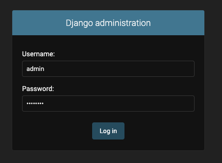
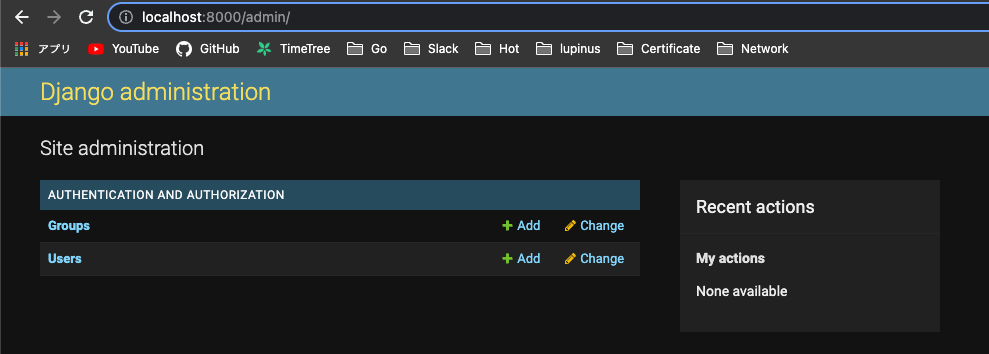
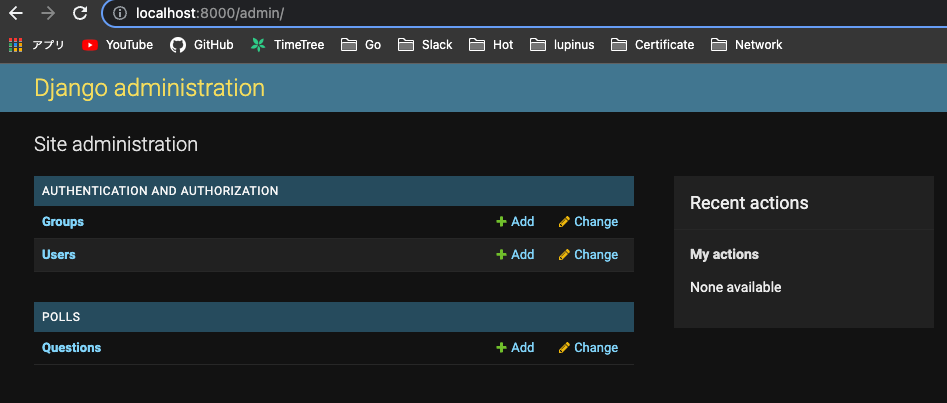

# django-tutorial

https://www.djangoproject.com/ のチュートリアルをやってみる

ここは[インストール方法](https://docs.djangoproject.com/ja/4.1/intro/tutorial01/)のdemo

# 実行方法

docker containerを立ち上げる

```bash
$ docker-compose up
[+] Running 1/0
 ⠿ Container python3  Recreated                                                                                                                                        0.1s
Attaching to app
app  | Python 3.11.2 (main, Mar 23 2023, 14:09:52) [GCC 10.2.1 20210110] on linux
app  | Type "help", "copyright", "credits" or "license" for more information.
...
```

# 遊ぶ

## Django Admin

サイト管理者を作る

```
$ python manage.py createsuperuser
Username: admin
Email address: okmt1230z@gmail.com
Password: P@ssw0rd
Superuser created successfully.
```


```
# python manage.py runserver 0.0.0.0:8000
```

`http://localhost:8000/admin`



ログインする



GroupsやUsersはDjangoに含まれる認証フレームワーク`django.contrib.auth`によって提供されている

Pollアプリケをadmin上で編集できるようにする

polls/admin.pyを編集する

```
from django.contrib import admin
from .models import Question

admin.site.register(Question)
```



色々編集できる素晴らしいadmin機能！

